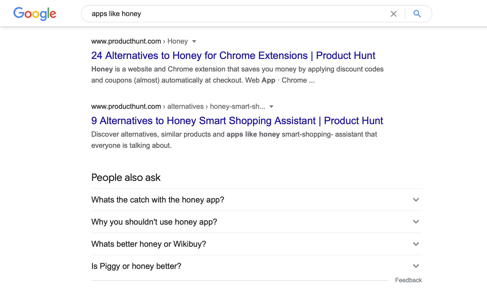

Last year I asked myself a question, could I scale SEO traffic by targeting thousands of longtail keywords? The answer turns out to be: yes.

## Escaping the SEO Rat Race

In late-2019, I tried making a traditional affiliate blog. I hired writers to create content that targeted low-competition keywords like:

- "Best Primer for Oily Skin"
- "Best Bluetooth Earbuds under \$50"

I quickly realized this was just an SEO rat race that served no greater purpose than to compete against 100s of other people chasing after the same keywords.

## Identifying Google's Weakness

What became more evident to me was that searching on Google for answers to keywords like the above was a bad experience.

Google's Search offering:

- Their best guess on which web page you will find most relevant to their search based on their data on billions of web pages
- Ads

What Google is missing:

- Predictive recommendations
- Insights
- And much more

Rather than taking on bloggers, I ambitiously tried to take on the Google search experience.

## Building a Business Around Data

As my first sincere effort to solve this problem, I built <a href="https://recorank.com" target="_blank">RecoRank</a>, a Rotten Tomatoes-style aggregator of consumer electronic reviews.

RecoRank finds new products and reviews for those products every day, along with other relevant information, and presents it in a consumable format.

Within a short time, I collected and presented data for over a thousand products.

Reception of RecoRank was generally positive, but building traction was a challenge.

Building brand awareness where most of my traffic becomes people searching "recorank" would take a lot of time, so how could I scale quickly?

<video src="./rr-demo.mp4" style="width:100%;box-shadow: 2px 2px 10px grey;" autoplay loop></video>

## Longtail Keyword SEO at Scale

One thing I noticed when researching keywords for that affiliate blog mentioned above, I noticed there were **thousands and thousands of keywords with little to no competition**.

I wondered if there was a way to turn SEO upside down. Instead of going after a few high-traffic keywords, I could go for thousands of low-traffic keywords by dynamically creating thousands of pages tailored for each keyword.

If you don't know what a longtail keyword is, it's not "best laptop". Longtail is more like "ram for dell laptop". The nature of longtail keywords is that they are longer, more specific, and less competitive.

There's no question that Google prefers original content, but that content can take lots of shapes and sizes. Most of what you read about SEO advises on having a great blog with quality backlinks. And for most businesses, that's exactly what you should do.

But what if your audience is searching for keywords like:

- [apps like honey](https://www.google.com/search?q=apps+like+honey)
- [dropbox slack integration](https://www.google.com/search?q=dropbox+slack+integration)
- [is iron man on netflix](https://www.google.com/search?q=is+ironman+on+netflix)

↓↓↓

Does Google think it's reasonable for there to be a 2,000+ word blog post addressing these search terms? No, of course not. **Are there websites using their data to generate pages that target these keywords? You damn right there are.**

So I looked at what longtail keywords RecoRank could target with its data. I tried a bunch of variations, but what ended up working was going after "x vs y" searches.

With over a thousand products, I could **generate tens of thousands of product comparison pages** for products by category.

Here is an example:

<a href="https://recorank.com/vs/apple-airpods-vs-apple-airpods-pro" target="_blank">recorank.com/vs/apple-airpods-vs-apple-airpods-pro</a>

I then performed proper on-page SEO, submitted massive sitemaps to Google, and redirected a few expired quality domains to my site. Pretty much your standard stuff to increase your SEO performance without painstaking link building.

I'm going light here because there is a LOT of good content out there that details this at length.

The results have been pretty amazing, leading to over 100K organic visits and over 1.3M impressions from Google in 4 months.

What's also worth noting is the CTR and average position being really high. This is an effect of ranking for mostly low/no competition keywords.

## Implementing This Strategy for Yourself

1. Ask yourself whether your business has a lot of data that you make publicly available. If the answer is yes, then yes, you should 100% consider using this strategy. If the answer is no and SEO is of interest to your business, you probably want to stick with the traditional blog and brand awareness route.

2. It's just thinking about all of the different search syntax related to your business and how you can systematically build out all of these pages. Take a look and see if your competition is leveraging a similar strategy.

Just try to avoid medium-to-high competition keywords, particularly those with the word "best" in them, as there will likely be better quality content out there that you won't be able to compete successfully.

If you're curious to learn more about <a href="https://recorank.com" target="_blank">RecoRank</a> or how to apply this strategy to your business, hit me up on [Twitter](https://twitter.com/tavislochhead) or send me an email @ tavislochhead [ at ] gmail [ dot ] com.
