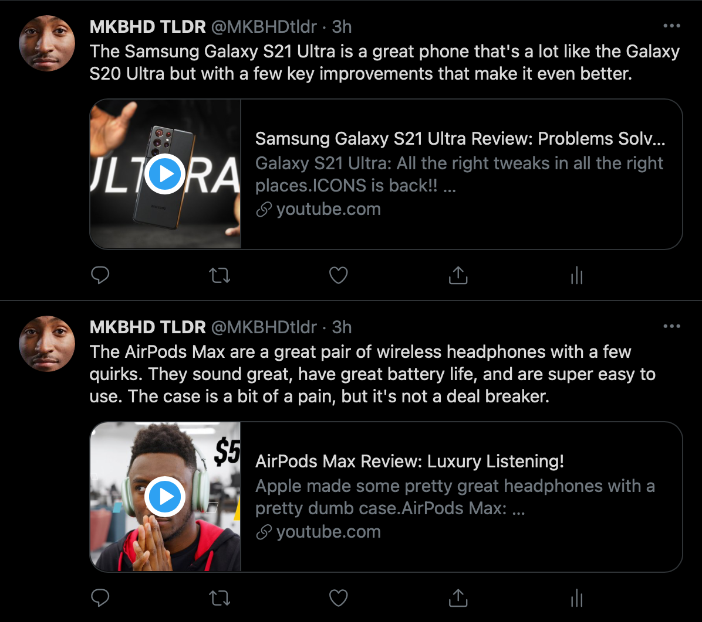
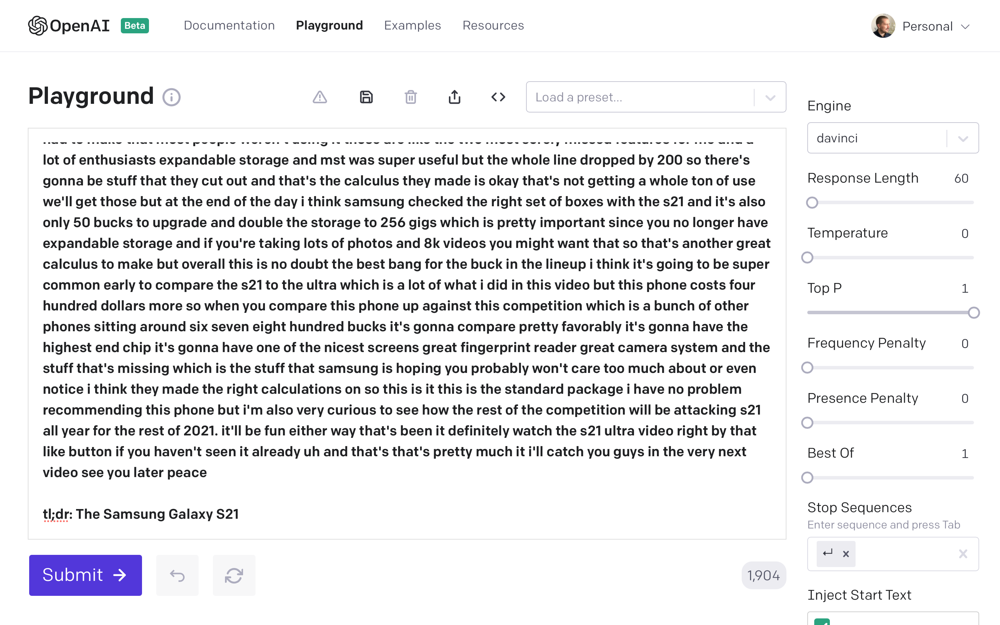

YouTube is the fastest-growing platform for all sorts of content. Video reviews being one of them. I love the quality that goes into these reviews. But what if there was a way to quickly grab consensus of these videos without spending hours watching them all?

TLDR: Yes, you can.

See the results 👉&nbsp;[twitter.com/MKBHDtldr](https://twitter.com/MKBHDtldr)


## Evolution of AI

Alongside the rapid growth of YouTube's popularity is AI innovation. One particular company that is gaining a lot of attention is Elon Musk-backed [OpenAI](https://openai.com).

Last week, I was fortunate enough to join their private beta program. So very quickly, I decided to try something I have wanted to do with <a href="https://recorank.com" target="_blank" rel="noopener">RecoRank</a> for some time: automated YouTube video review analysis using AI.

I'm a huge MKBHD fan. And as one of the top YouTube video reviewers, I tried using OpenAI to summarize his video review transcripts.

[The results have been amazing so far.](https://twitter.com/MKBHDtldr)



## Achieving These Results

**Step 1: Extract Transcripts**

```
from youtube_transcript_api import YouTubeTranscriptApi

subtitles = YouTubeTranscriptApi.get_transcript("dhAmMXCBIcg")

sub_list = []

for subtitle in subtitles:
    sub_list.append(subtitle['text'])

txt = " ".join(sub_list)

print(txt)
```

This simple Python script using [YouTubeTranscriptApi](https://pypi.org/project/youtube-transcript-api/) quickly gets you the transcript of any YouTube video - given that the video has a transcript. The API will produce an error if one does not exist.

**Step 2: Summarize with OpenAI**



I used OpenAI's `tl;dr:` (too long; didn't read) function to achieve AI-generated transcript summaries.

On top of the default settings, I also:

- Set temperature to `0` to exclude any improvisation of the results and get the summary with no guesswork
- Added `The [product name]` right after `tl;dr:` to guide OpenAI on what I wanted (i.e. `The iPhone 12 is a great phone, but it's not a huge leap forward.` - I didn't do this for all summaries, but I did find that this method delivered the most consistent results than just using `tl;dr` on its own)
- Deleted enough of the start of the transcript to fit within the 2048 token limit (in the case with most reviews, more of the meat is at the end than the beginning, particularly final thoughts)
- Added a return break `⏎` as a Stop Sequence to limit the results to one paragraph

## What's Next?

These are just the results of one week of experimentation with OpenAI. Pros and cons are other areas to explore.

These are the pros and cons results for MKBHD's Samsung Galaxy S21 review:

```
Pros:
– Great display
– Great performance
– Great cameras
– Great battery life
– Great design
– Great value

Cons:
– No expandable storage
– No MST
– No S Pen
– No wireless charging
```

I'm hoping to add these insights to <a href="https://recorank.com" target="_blank" rel="noopener">RecoRank</a> soon.

My friend Adrian Krebs has a <a href="https://www.buyforlife.com/blog/548RijnkRdPwn1cAI5RDjw/make-better-and-faster-purchasing-decisions-with-ai" target="_blank" rel="noopener">blog post</a> about his trials in this area for his business, <a href="https://BuyForLife.com" target="_blank" rel="noopener">BuyForLife.com</a>. Definitely worth a read.

Have an idea of how OpenAI could be applied for review analysis and summarization? I’d love to hear from you. Hit me up on [Twitter](https://twitter.com/tavislochhead) or send me an email @ tavislochhead [ at ] gmail [ dot ] com.
