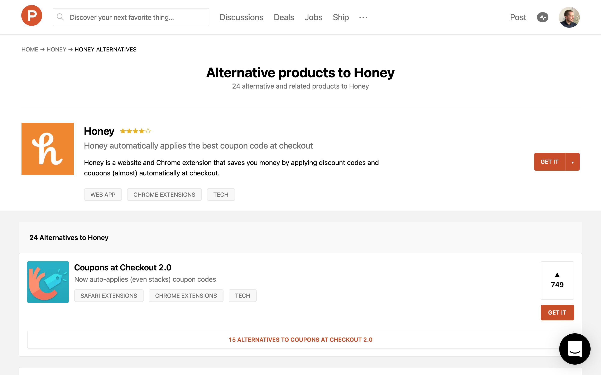

Last year I asked myself a question, could I scale SEO traffic by targeting thousands of long-tail keywords? The answer turns out to be: yes.

**April 1, 2021 UPDATE:** Originally, this post was about 100K visits over 4 months. Data is updated to show performance over 5 months, which shows flattening of growth. I'll report back in the next month or two.

## Looking Beyond the SEO Rat Race

If you read up on SEO strategy, the majority of guidance is to write a good blog, get some good backlinks, and build your brand.

While this is sound advice, it's not the only way to approach SEO, and it excludes other areas of opportunity.

## Give People What They're Actually Searching For

According to a [study done by Ahrefs](https://ahrefs.com/blog/long-tail-keywords/), 92% of keywords in their dataset of 1.9B search queries classify as long-tail, which accounts for 39% of total searches.

## What Are Long-tail Keywords?

Here's how Tim Soulo from Ahrefs describes long-tail keywords.

> Long-tail keywords are terms with low search volumes. Despite what many people think, it has nothing to do with how long or short a keyword is, how well it’s likely to convert, or how specific it is.

## Targeting Long-tail Keywords Effectively

While Tim is correct about long-tail keywords, the strategy I will discuss here targets long-tail keywords that are indeed **_specific_**.

Search engines like Google group similar search terms together, such as "how to lose weight quickly" and "fastest way to lose weight".

Google DOES treat specific search terms differently. If you're living in Toronto, the searches "best restaurant" and "best restaurant new york" are going to give you very different results.

Since each long-tail keyword delivers a tiny bit of traffic, you will need to target many keywords with a lot of pages.

## Example: RecoRank

While not all businesses may be structured to use this strategy, my business <a href="https://recorank.com" target="_blank">RecoRank</a> has been able to do so.

If you're not aware of RecoRank, it's an application that finds reviews and relevant information for consumer electronic products every day and presents it in a consumable format.

<video src="./rr-demo.mp4" style="width:100%;box-shadow: 2px 2px 10px grey;" autoplay loop></video>

With a large dataset of content that people search for on places like YouTube and Google, I discovered RecoRank was a good fit for building thousands of static pages that all individually targeted specific long-tail keywords.

## Trial and Error

If you look at RecoRank's [robots.txt](https://recorank.com/robots.txt), you can see a variety of experiments I have tried. Right now, the VS's keywords have paid off. The rest, not so much.

Here is what a RecoRank VS page looks like:

<a href="https://recorank.com/vs/apple-airpods-vs-apple-airpods-pro" target="_blank">recorank.com/vs/apple-airpods-vs-apple-airpods-pro</a>

I'll admit, the page isn't mind-blowing. However, the average session duration for these pages is about a minute, which isn't bad.

Nevertheless, RecoRank is looking at smarter ways to analyze and present this kind of data, such as using [Open AI](https://openai.com).

[You can read about my first experiment using OpenAI to summarize MKBHD's video reviews.](/mkbhd-tldr)

Even without any fancy AI-powered content analysis, the results so far have been pretty amazing. Pretty much all of RecoRank's traffic goes to these comparison pages, which has resulted in 152K visits and 2.16M impressions from Google in 5 months.

What's also worth noting is the CTR and average position being really high. This is an effect of ranking for mostly low/no competition keywords.

## But Wait, Google Only Likes Original Content!

Google loves original content. But what is original content? A 2,000-word article is. So is a company website. But what about presenting information in ways that are relevant to someone's search?

Let's take a look at these keywords:

- [apps like honey](https://www.google.com/search?q=apps+like+honey)
- [dropbox slack integration](https://www.google.com/search?q=dropbox+slack+integration)
- [is iron man on netflix](https://www.google.com/search?q=is+ironman+on+netflix)

Here's what happens when you click on the link to Product Hunt when searching "apps like honey".

↓↓↓

This is an automatically-generated page. Product Hunt has thousands of these types of pages, and they're all in their [sitemap](https://www.producthunt.com/robots.txt).

## Implementing This Strategy for Yourself

1. Ask yourself whether your business has a lot of data that you make publicly available. If the answer is yes, then yes, you should 100% consider using this strategy. If the answer is no and SEO is of interest to your business, you probably want to stick with the traditional blog and brand awareness route.

2. Think about all of the different search syntax related to your business and how you can systematically build out countless static pages that target **_specific_** long-tail keywords. Also, take a look and see if your competition is leveraging a similar strategy.

3. Avoid medium-to-high competition keywords, particularly those with the word "best" in them, as there will likely be better quality content out there that you won't be able to compete with successfully.

4. Optimize your success by performing proper on-page SEO and submitting your sitemaps to Google. It helps if your domain has a good DR, which you can accelerate with an expired domain redirect (do at your own risk).

If you're curious to learn more about <a href="https://recorank.com" target="_blank">RecoRank</a> or how to apply this strategy to your business, hit me up on [Twitter](https://twitter.com/tavislochhead) or send me an email @ tavislochhead [ at ] gmail [ dot ] com.
